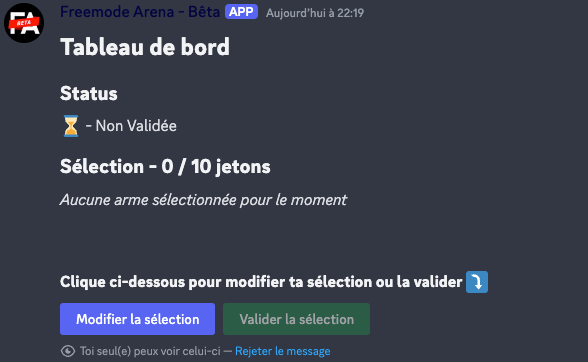
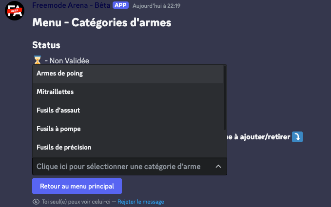

# Freemode Arena - Services

Freemode Arena is a championship organized by some Discord's users on Glitch GTA France. This repository contains the
official Discord bot that is used during the championship.

The implementation depends on the needs AND the ideas of the organizers. The bot is not meant to be used by others...

----

## Commands
All the commands are using the native Discord's slash commands. Here is the list of the available commands:
- `/init` (global) -> Set up the bot for the first time in the guild and register non-global commands
- `/ping` -> Simple command that returns the bot's latency mostly used to check if the bot is online
- `/clear-database` -> Dev only command that clears the database (this one is published in production but will throw an error if used)
- `/annonces inscription` -> Send the official message to allow users to register to the championship
- `/annonces matchmaking` -> Send the official message to allow users to search for a match
- `/admin match étape` -> *not implemented yet*
- `/admin match statut` -> Return information about the current match (needs to be run inside the channel of a match)
- `/admin joueur statut` -> Return information about the player provided in argument
- `/admin joueur niveau` -> Update the level of the player by the one provided in argument to try to equilibrate the matchmaking

## Features
### Map randomizer
The bot has 2 randomization systems that can be used depending on the configuration:
- **Simple** -> Use a `Math.random()` to pick a map in the list without any other logic
- **Weighted** -> Use a weighted system to pick a map in the list. The weight is calculated based on the number of times 
the map has been played by the players in the match. This system has been introduced because we found that some maps were played more often than others.

## Matchmaking
No system has been put in place to select opponent. For now, we just match two players that never played together AND 
use the order of arrival in the matchmaking channel to select the players. This system is not perfect and will be 
improved in the future.

To avoid any issue in the match where a *noob* player is matched with a *pro* player, we have implemented a system that
limit the choice of weapons based on the level of the player and the one of the opponent.

## User interface
In order to provide the best experience through a Discord bot, I've imagined a system that allows the user to interact
with the bot through Discord native button to create a kind of page that updates itself based on the user's actions.

For e.g., when a match is found and the user has to select his weapons, he has to click on the button "Edit selection"
and the button send a message with the status of the selection :


From that, he can validate his selection or change it. The bot will update the message to allow the user to select the
category of weapons he wants to use, etc.


This kind of system has been widely used in the bot to provide a better experience to the users and help them to better
understand the process.

---

## Installation
1. Install Node.js
2. Clone the repository
3. Run `npm install` to install the dependencies
4. Create a `.env` file at the root of the project with the following content:
```dotenv
FA_DATABASE_URL_CONNECTION="<mongodb_connection>"
FA_DISCORD_BOT_TOKEN="<discord_bot_token>"
```
5. Run `npm run dev` to start the bot in development mode

## Configuration
The whole bot is configurable through the `src/constants/configuration.ts` file.

---

## Contributing
For now, the bot is not meant to be used by others. However, if you want to contribute to the project, feel free to open
a pull request with your changes. I will be happy to review them and discuss them with you.

## License
This project is licensed under the MIT License - see the [LICENSE](./LICENSE) file for details.
